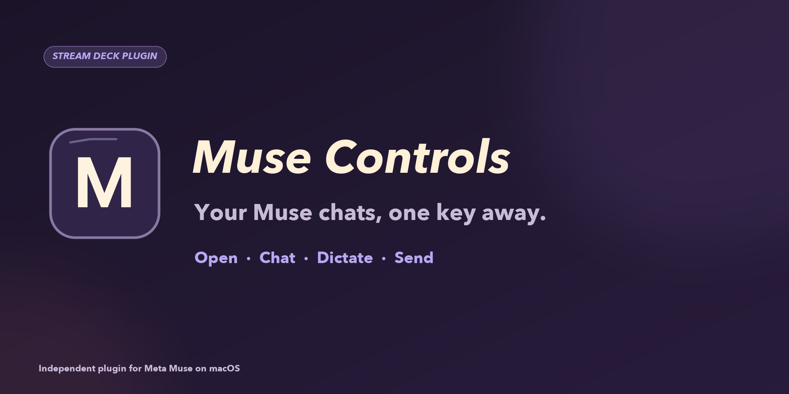

# Muse Controls for Stream Deck

A local Stream Deck plugin for the installed Meta Muse Mac app (`com.meta.endo`). It uses Muse's visible Mac controls and the signed-in app. It does not use a Meta API key or read conversation history. This independent plugin is not affiliated with Meta.



**Download:** [com.davidedicillo.muse.streamDeckPlugin](dist/com.davidedicillo.muse.streamDeckPlugin) (v0.4.0.0), then double-click to install.

**Support:** [SUPPORT.md](SUPPORT.md) · **Privacy:** [PRIVACY.md](PRIVACY.md) · **Issues:** use the Issues tab on this repository.

## Install and use

Double-click `com.davidedicillo.muse.streamDeckPlugin` to install, or run `streamdeck link com.davidedicillo.muse.sdPlugin` from the source directory. Requires macOS 12+, Stream Deck 7.1+, Meta Muse, and Accessibility access for Stream Deck in System Settings. Drag actions from the Stream Deck action list onto free keys:

| Action | Behavior |
| --- | --- |
| Open Muse | Opens or focuses Muse and selects Main chat. |
| New Side Chat | Opens or focuses Muse and creates an empty side chat. |
| Dictate | Press once to start recording; the key changes to a stop square. Press again to stop without sending. If Muse is already frontmost, a new recording starts in its visible chat. Otherwise it starts in Main chat. An active recording is stopped before any chat switch. |
| Finish & Send | In the visible chat, finishes an active dictation using Muse's Send control and submits it. When idle, sends a nonempty draft already in the composer. An empty draft sends nothing. |
| Send Saved Prompt | Sends the prompt configured for that one key to the visible chat. An empty prompt sends nothing. If Muse has an unsent draft, it shows an error and leaves the draft alone. |

For Send Saved Prompt, select its key in Stream Deck and enter text in the **Prompt for this key** field. Each key has independent settings. The helper verifies the inserted text before activating Send. Because Muse currently exposes its composer as one combined accessibility button, the helper locates its microphone and send controls by their positions within that button; a future Muse layout change may require updating `native/MuseBridge.swift`.

The key art is generated by `native/GenerateIcons.swift`. Open Muse currently has a static letter icon. It does not include Meta's animated avatar.

The helper temporarily uses the macOS clipboard to check for an unsent draft, paste a saved prompt, and verify the result. Finish & Send also checks the draft this way when idle. It restores the previous clipboard contents and does not log the draft or prompt, but a clipboard-history app could retain either while it is on the clipboard. Avoid saved prompts containing secrets if you use a clipboard manager.

## Build

The project was built with Node 24.21.0, `@elgato/cli` 1.10.1, Swift 6.3.0, and Python Pillow 12.3.0 for Marketplace media. With Node 24 active and Pillow installed:

```sh
npm install
npm run build:native
npm test
npm run build
python3 tools/prepare_marketplace_assets.py
streamdeck validate com.davidedicillo.muse.sdPlugin
streamdeck pack com.davidedicillo.muse.sdPlugin --output ../../outputs
```

The Swift helper lives in `native/MuseBridge.swift`; the Stream Deck actions live in `src/actions/`. To add an action, add a `SingletonAction` class, register it in `src/plugin.ts`, add it to the manifest, and implement the matching helper command. Keep prompt text out of logs and process arguments.
